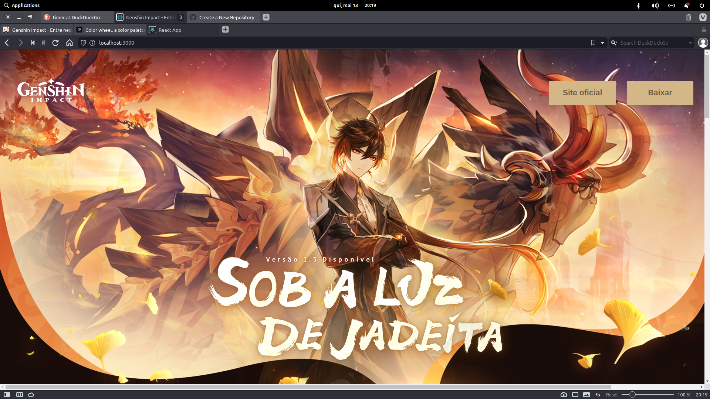
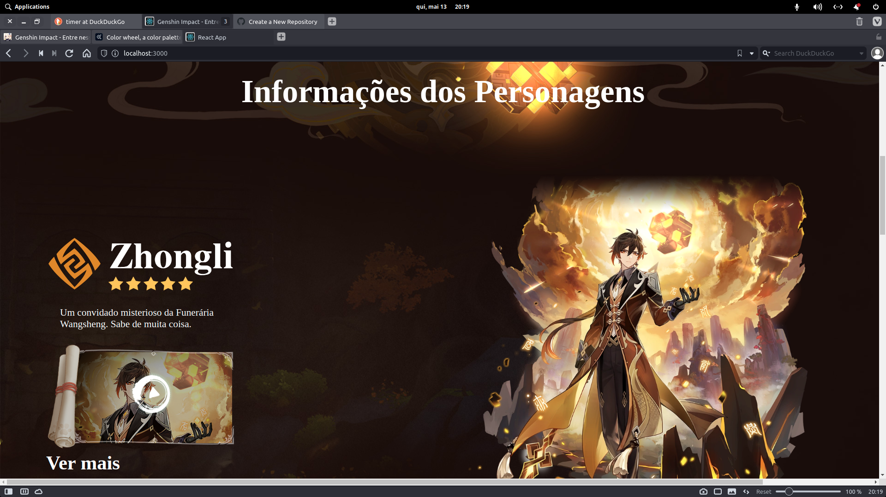
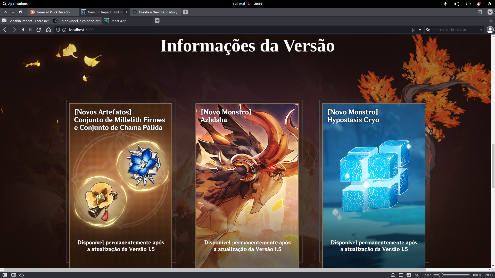
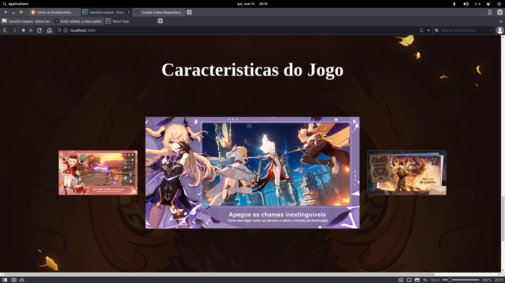
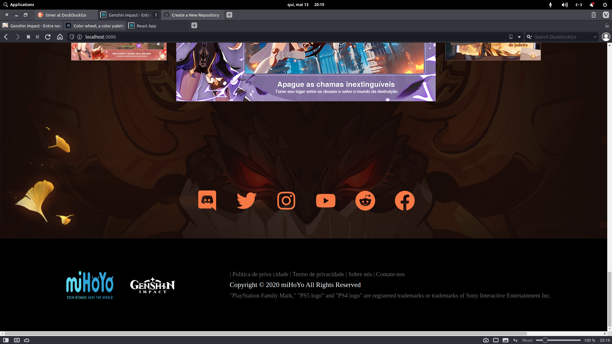

<h1>Genshin Impact</h1>
<h2>Speedy code</h2>

    Trying finish genshin website in less than 1 hour. 
    this is the result:

I will post a video about this speed run, when I post, I will edit this readme again. :slightly_smiling_face: 

<h1>Make with :heart: Gustavo S. Melo </h1>
